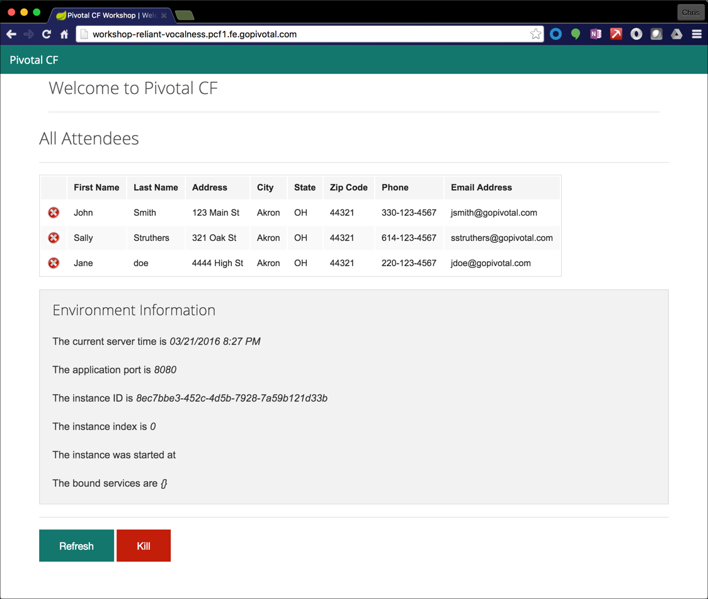

= Lab 1 - From Zero to Pushing Your First Application

== Target

. If you haven't already, download the latest release of the Cloud Foundry CLI from https://github.com/cloudfoundry/cli/releases for your operating system and install it.

. Create a trial http://run.pivotal.io[Pivotal Web Services] account to use Pivotal’s web-hosted Cloud Foundry for labs 1 - 7.

. Set the API target for the CLI: (set appropriate end point for your environment)
+
For a Pivotal Web Services account, use:
+
----
$ cf api https://api.run.pivotal.io --skip-ssl-validation
----
+
Or, if you are using the Workshop PCF Instance student account:
+
----
$ cf api https://api.pcf1.fe.gopivotal.com --skip-ssl-validation
----

. Login to Pivotal Cloudfoundry with your PWS credentials, or your workshop student account credentials:
+
----
$ cf login -u student1
----
+
And follow the prompts.

== Push It!

. Change to the _cf-spring-mvc-boot_ sample application directory:
+
----
$ cd $COURSE_HOME/cf-spring-mvc-boot
----

. Push the application!
+
----
$ cf push
----
+
You should see output similar to the following listing. Take a look at the listing callouts for a play-by-play of what's happening:
+
====
----
Using manifest file /Users/cbusch/git/cloud-native-workshop/cf-spring-mvc-boot/manifest.yml <1>

Creating app workshop in org system / space apps-manager as instructor...
OK <2>

Creating route workshop-reliant-vocalness.pcf1.fe.gopivotal.com...
OK <3>

Binding workshop-reliant-vocalness.pcf1.fe.gopivotal.com to workshop...
OK <4>

Uploading workshop... <5>
Uploading app files from: /var/folders/f1/7hhb3pjs04bb6fxrcr2vx_6r0000gp/T/unzipped-app407613013
Uploading 1.4M, 146 files
Done uploading
OK

Starting app workshop in org system / space apps-manager as instructor... <6>
Downloading nodejs_buildpack...
Downloading go_buildpack...
Downloading python_buildpack...
Downloading staticfile_buildpack...
Downloading php_buildpack_new...
Downloading java_buildpack...
Downloading php_buildpack...
Downloading binary_buildpack...
Downloading java_buildpack_offline...
Downloading ruby_buildpack...
Downloaded java_buildpack_offline
Downloaded nodejs_buildpack
Downloaded java_buildpack
Downloaded python_buildpack
Downloaded ruby_buildpack
Downloaded go_buildpack
Downloaded php_buildpack_new
Downloaded binary_buildpack
Downloaded php_buildpack
Downloaded staticfile_buildpack
Creating container
Successfully created container <7>
Downloading app package...
Downloaded app package (26.7M)
Staging...
-----> Java Buildpack Version: v3.3.1 | https://github.com/cloudfoundry/java-buildpack.git#063836b
-----> Downloading Open Jdk JRE 1.8.0_73 from https://download.run.pivotal.io/openjdk/trusty/x86_64/openjdk-1.8.0_73.tar.gz (6.2s)
       Expanding Open Jdk JRE to .java-buildpack/open_jdk_jre (1.7s) <8>
-----> Downloading Open JDK Like Memory Calculator 2.0.1_RELEASE from https://download.run.pivotal.io/memory-calculator/trusty/x86_64/memory-calculator-2.0.1_RELEASE.tar.gz (0.3s)
       Memory Settings: -Xms382293K -XX:MetaspaceSize=64M -Xmx382293K -XX:MaxMetaspaceSize=64M -Xss995K
-----> Downloading Spring Auto Reconfiguration 1.10.0_RELEASE from https://download.run.pivotal.io/auto-reconfiguration/auto-reconfiguration-1.10.0_RELEASE.jar (0.3s)
Exit status 0
Staging complete
Uploading droplet, build artifacts cache...
Uploading droplet...
Uploading build artifacts cache...
Uploaded build artifacts cache (44.7M)
Uploaded droplet (71.6M) <9>
Uploading complete

0 of 1 instances running, 1 starting
0 of 1 instances running, 1 starting
0 of 1 instances running, 1 starting
1 of 1 instances running

App started

OK

App workshop was started using this command `CALCULATED_MEMORY=$($PWD/.java-buildpack/open_jdk_jre/bin/java-buildpack-memory-calculator-2.0.1_RELEASE -memorySizes=metaspace:64m.. -memoryWeights=heap:75,metaspace:10,native:10,stack:5 -memoryInitials=heap:100%,metaspace:100% -totMemory=$MEMORY_LIMIT) && SERVER_PORT=$PORT $PWD/.java-buildpack/open_jdk_jre/bin/java -cp $PWD/.:$PWD/.java-buildpack/spring_auto_reconfiguration/spring_auto_reconfiguration-1.10.0_RELEASE.jar -Djava.io.tmpdir=$TMPDIR -XX:OnOutOfMemoryError=$PWD/.java-buildpack/open_jdk_jre/bin/killjava.sh $CALCULATED_MEMORY -Djava.security.egd=file:///dev/urandom org.springframework.boot.loader.JarLauncher` <10>

Showing health and status for app workshop in org system / space apps-manager as instructor... <11>
OK

requested state: started
instances: 1/1
usage: 512M x 1 instances
urls: workshop-reliant-vocalness.pcf1.fe.gopivotal.com
last uploaded: Mon Mar 21 20:07:07 UTC 2016
stack: unknown
buildpack: java-buildpack=v3.3.1-https://github.com/cloudfoundry/java-buildpack.git#063836b java-main java-opts open-jdk-like-jre=1.8.0_73 open-jdk-like-memory-calculator=2.0.1_RELEASE spring-auto-reconfiguration=1.10.0_RELEASE

     state     since                    cpu    memory           disk           details
#0   running   2016-03-21 03:08:31 PM   0.0%   192.6M of 512M   153.4M of 1G
----
<1> The CLI is using a manifest to provide necessary configuration details such as application name, memory to be allocated, and path to the application artifact.
Take a look at `manifest.yml` to see how.
<2> In most cases, the CLI indicates each Cloud Foundry API call as it happens.
In this case, the CLI has created an application record for _Workshop_ in your assigned space.
<3> All HTTP/HTTPS requests to applications will flow through Cloud Foundry's front-end router called http://docs.cloudfoundry.org/concepts/architecture/router.html[(Go)Router].
Here the CLI is creating a route with random word tokens inserted (again, see `manifest.yml` for a hint!) to prevent route collisions across the default `pcf1.fe.gopivotal.com` domain.
<4> Now the CLI is _binding_ the created route to the application.
Routes can actually be bound to multiple applications to support techniques such as http://www.mattstine.com/2013/07/10/blue-green-deployments-on-cloudfoundry[blue-green deployments].
<5> The CLI finally uploads the application bits to Pivotal Cloudfoundry. Notice that it's uploading _75 files_! This is because Cloud Foundry actually explodes a ZIP artifact before uploading it for caching purposes.
<6> Now we begin the staging process. The https://github.com/cloudfoundry/java-buildpack[Java Buildpack] is responsible for assembling the runtime components necessary to run the application.
<7> Created container to stage teh application.
<8> Here we see the version of the JRE that has been chosen and installed.
<9> The complete package of your application and all of its necessary runtime components is called a _droplet_.
Here the droplet is being uploaded to Pivotal Cloudfoundry's internal blobstore so that it can be easily copied to one or more _http://docs.cloudfoundry.org/concepts/architecture/execution-agent.html[Droplet Execution Agents (DEA's)]_ for execution.
<10> The CLI tells you exactly what command and argument set was used to start your application.
<11> Finally the CLI reports the current status of your application's health.
====

. Visit the application in your browser by using the `urls: workshop-XXXX.pcf1.fe.gopivotal.com` the route that was generated by the `cf push` command in the above step:
+

== Interact with App from CF CLI

. Get information about the currently deployed application using CLI apps command:
+
----
$ cf apps
----
+
Note the application name for next steps

. Get information about running instances, memory, CPU, and other statistics using CLI instances command
+
----
$ cf app <<app_name>>
----

. Stop the deployed application using the CLI
+
----
$ cf stop <<app_name>>
----

. Delete the deployed application using the CLI
+
----
$ cf delete <<app_name>>
----

link:/README.adoc#hands-on-labs-materials[Course Materials home] | link:/labs/lab_02/lab.adoc[Lab 2- Binding to Cloud Foundry Services]
