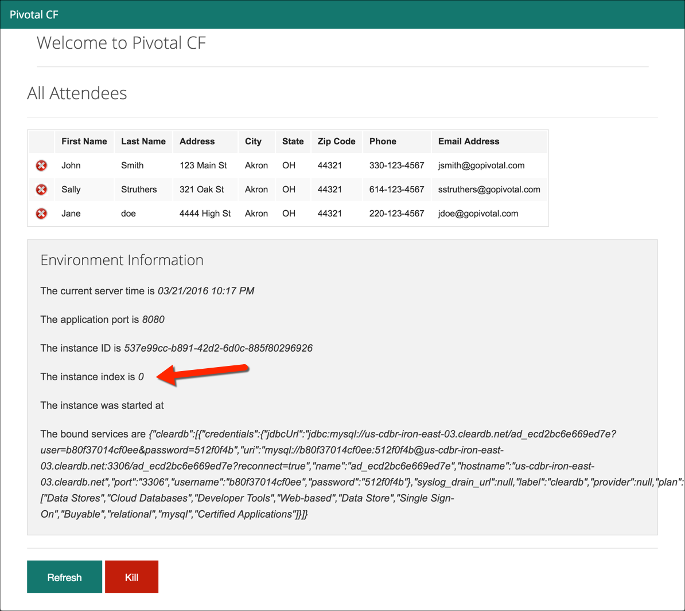
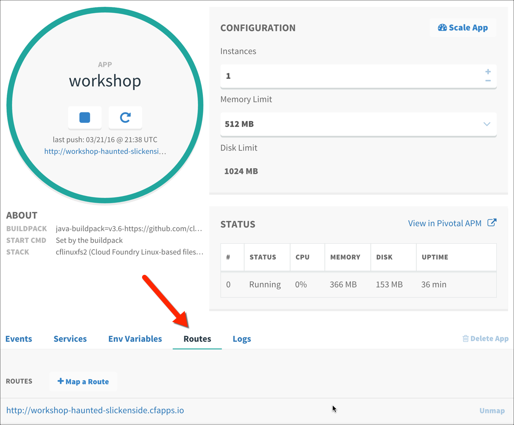
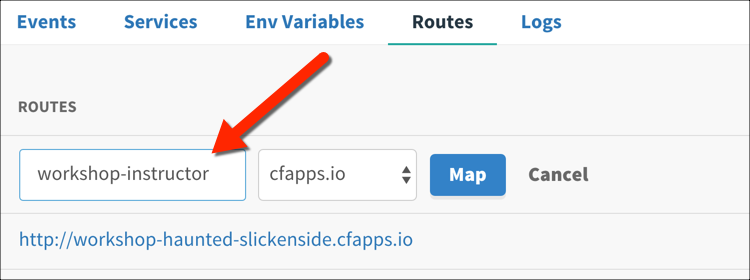
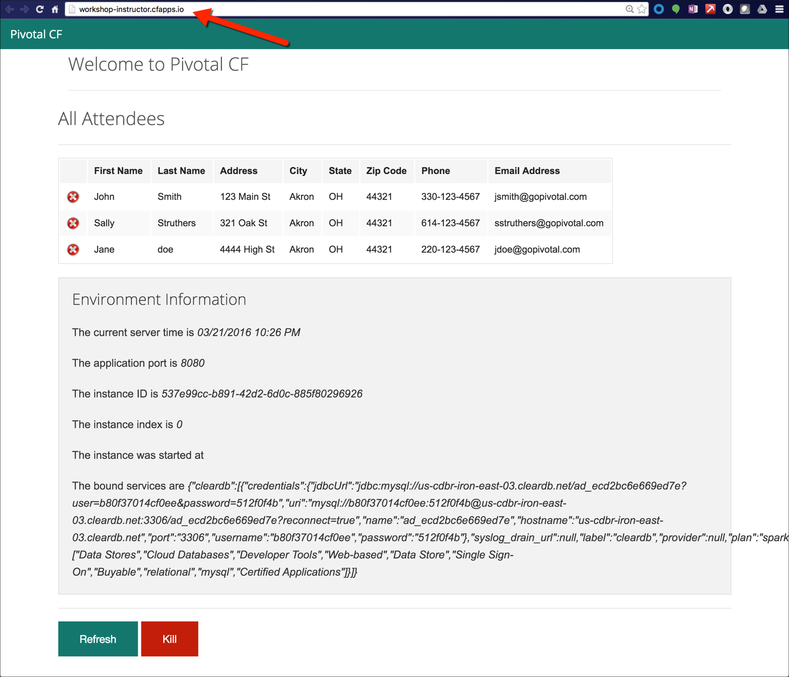
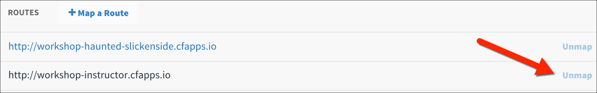

= Lab 3 - Operating your Application

[abstract]
--
Pivotal Cloudfoundry makes the work of performing operations actions, such as scaling, doing a zero-downtime deploy, and managing application health very easy.
In the next two labs we'll explore Pivotal Cloudfoundry operations.
--

== Scale the Application Up

. Now let's increase the number of running application instances to 3.  For this lab you can use the Java, Ruby, or Node.js sample app.  In each of the commands below replace _workshop_ with the name of your deployed application:
+
----
$ cf scale -i 3 workshop
Scaling app workshop in org instructor-org / space development as instructor...
OK
----
+
In reporting `OK`, the CLI is letting you know that the additional requested instances have been started, but they are not yet necessarily running.

. We can determine how many instances are actually running like this:
+
====
----
$ cf app workshop
Showing health and status for app workshop in org instructor-org / space development as instructor...
OK

requested state: started
instances: 3/3
usage: 512M x 3 instances
urls: workshop-haunted-slickenside.cfapps.io
last uploaded: Mon Mar 21 21:38:44 UTC 2016
stack: cflinuxfs2
buildpack: java-buildpack=v3.6-https://github.com/cloudfoundry/java-buildpack.git#5194155 java-main java-opts open-jdk-like-jre=1.8.0_73 open-jdk-like-memory-calculator=2.0.1_RELEASE spring-auto-reconfiguration=1.10.0_RELEASE

     state     since                    cpu    memory           disk           details
#0   running   2016-03-21 04:43:55 PM   0.1%   349.9M of 512M   153.4M of 1G <1>
#1   starting  2016-03-21 05:05:31 PM   0.1%   0 of 0           0 of 0 <2>
#2   starting  2016-03-21 05:05:31 PM   0.0%   0 of 0           0 of 0
----
<1> This application instance has completed the startup process and is actually able to accept requests.
<2> This application instance is still starting and will not have any requests routed to it.
====

. Eventually all instances will converge to a running state:
+
----
$ cf app workshop
Showing health and status for app workshop in org instructor-org / space development as instructor...
OK

requested state: started
instances: 3/3
usage: 512M x 3 instances
urls: workshop-haunted-slickenside.cfapps.io
last uploaded: Mon Mar 21 21:38:44 UTC 2016
stack: cflinuxfs2
buildpack: java-buildpack=v3.6-https://github.com/cloudfoundry/java-buildpack.git#5194155 java-main java-opts open-jdk-like-jre=1.8.0_73 open-jdk-like-memory-calculator=2.0.1_RELEASE spring-auto-reconfiguration=1.10.0_RELEASE

     state     since                    cpu    memory           disk           details
#0   running   2016-03-21 04:43:55 PM   0.1%   349.9M of 512M   153.4M of 1G
#1   running   2016-03-21 05:05:49 PM   0.1%   346.7M of 512M   153.4M of 1G
#2   running   2016-03-21 05:05:49 PM   0.2%   346M of 512M     153.4M of 1G
----

. Revisit the application route in the browser.
Refresh several times.
You should observe the instance index changing as you do so:
+

+
The aforementioned http://docs.cloudfoundry.org/concepts/architecture/router.html[Router] is applying a random routing algorithm to all of the application instances assigned to this route. As an instance reaches the `running` state, its instance is registered in the routing table assigned to its route. All Router instances are subscribed to this channel and register the routes independently.
This makes for very dynamic and rapid reconfiguration!

== Scale the Application Down

. We can scale the application instances back down as easily as we scaled them up, using the same command structure:
+
----
$ cf scale -i 1 workshop
Scaling app workshop in org instructor-org / space development as instructor...
OK
----

. Check the application status again:
+
----
$ cf app workshop
Showing health and status for app workshop in org instructor-org / space development as instructor...
OK

requested state: started
instances: 1/1
usage: 512M x 1 instances
urls: workshop-haunted-slickenside.cfapps.io
last uploaded: Mon Mar 21 21:38:44 UTC 2016
stack: cflinuxfs2
buildpack: java-buildpack=v3.6-https://github.com/cloudfoundry/java-buildpack.git#5194155 java-main java-opts open-jdk-like-jre=1.8.0_73 open-jdk-like-memory-calculator=2.0.1_RELEASE spring-auto-reconfiguration=1.10.0_RELEASE

     state     since                    cpu    memory           disk           details
#0   running   2016-03-21 04:43:55 PM   0.1%   352.6M of 512M   153.4M of 1G
----
+
As you can see, we're back down to only one instance running, and it is in fact the original index 0 that we started with.

. Confirm that by again revisiting the route in the browser and checking the instance index:
+

== HTTP Routing

There are two ways to discover what routes, or HTTP URLs, are mapped to an application
The first is available via the CLI. Just type:

----
$ cf app workshop
Showing health and status for app workshop in org instructor-org / space development as instructor...
OK

requested state: started
instances: 1/1
usage: 512M x 1 instances
urls: workshop-haunted-slickenside.cfapps.io
last uploaded: Mon Mar 21 21:38:44 UTC 2016
stack: cflinuxfs2
buildpack: java-buildpack=v3.6-https://github.com/cloudfoundry/java-buildpack.git#5194155 java-main java-opts open-jdk-like-jre=1.8.0_73 open-jdk-like-memory-calculator=2.0.1_RELEASE spring-auto-reconfiguration=1.10.0_RELEASE

     state     since                    cpu    memory           disk           details
#0   running   2016-03-21 04:43:55 PM   0.1%   352.6M of 512M   153.4M of 1G
----

and you'll see the list of routes in the section that says _urls_.

The second way is via the Apps Manager UI.  Click on the _Workshop_ application to view application details.  Select the _Routes_ tab to view a list of mapped routes:

. We can easily add an additional route by clicking on _+ Map a Route_ and supplying the new hostname. Use a unique name, not _instructor_, and then click _Map_:
+

. Navigate to the new URL in your browser window.  You should see that same application displayed!
+

. We can just as easily remove a route by clicking on _Unmap_ on the route you wish to remove.
+

+
If you navigate to that URL you'll receive a HTTP 404 response
+

. This is how blue-green deployments are accomplished.
+
image::blue-green.png[]

== Accessing Container Contents

. The contents of a deployed application and a specific container may be viewed with the _cf ssh_ (secure shell) command within the CLI, as long as SSH is allowed for the specified application. Use the following command to access the application container:
+
----
$ cf ssh workshop <1>
vcap@f8eg5grhrgj:~$
----
<1> If you have multiple instances of an application, `cf ssh -i 2 myapp` would get into the specific instance.
+
. Once SSH'd into the container, execute the `ls -al` command to see the contents of the `/home/vcap` directory.
+
----
vcap@f8eg5grhrgj:~$ ls -al
total 40
drwx------ 6 vcap vcap 4096 Mar 22 13:36 .
drwxr-xr-x 4 root root 4096 Mar 21 21:43 ..
drwxr-xr-x 9 vcap root 4096 Mar 21 21:43 app
-rw------- 1 vcap vcap   18 Mar 22 13:36 .bash_history
-rw-r--r-- 1 vcap vcap  220 Apr  9  2014 .bash_logout
-rw-r--r-- 1 vcap vcap 3637 Apr  9  2014 .bashrc
drwxr-xr-x 2 vcap vcap 4096 Mar 21 21:43 logs
-rw-r--r-- 1 vcap vcap  675 Apr  9  2014 .profile
-rw-r--r-- 1 vcap vcap  943 Mar 21 21:43 staging_info.yml
drwxr-xr-x 3 vcap vcap 4096 Mar 21 21:43 tmp
----
. To see the contents of the application directory, run the following command:
+
----
vcap@f8eg5grhrgj:~$ ls -al app <1>
total 40
drwxr-xr-x 9 vcap root 4096 Mar 21 21:43 .
drwx------ 6 vcap vcap 4096 Mar 22 13:36 ..
-rw-r--r-- 1 vcap vcap   28 Mar 21 21:38 application.properties
drwxr-xr-x 3 vcap vcap 4096 Mar 21 21:38 io
drwxr-xr-x 4 vcap vcap 4096 Mar 21 21:43 .java-buildpack
drwxr-xr-x 2 vcap vcap 4096 Mar 21 21:38 lib
drwxr-xr-x 3 vcap vcap 4096 Mar 21 21:38 META-INF
drwxr-xr-x 3 vcap vcap 4096 Mar 21 21:38 org
drwxr-xr-x 5 vcap vcap 4096 Mar 21 21:38 static
drwxr-xr-x 2 vcap vcap 4096 Mar 21 21:38 templates
----
<1> The actual binaries of the application can be found in the `/app` folder
+

. In addition to `cf ssh`, you can use other SSH clients such as `ssh`, `scp`, or `sftp` to access your application, as long as you have SSH permissions. See the https://docs.cloudfoundry.org/devguide/deploy-apps/ssh-apps.html[Application SSH Access without cf CLI] documentation for more information.

. Type `exit` at the command prompt to exit SSH and return to your local prompt.
+
----
vcap@f8eg5grhrgj:~$ exit
exit
$
----

link:/README.adoc#hands-on-labs-materials[Course Materials home] | link:/labs/lab4/lab.adoc[Lab 4 - Monitoring your Application]
